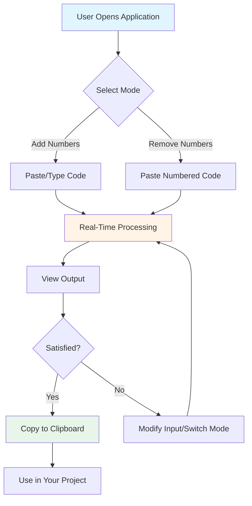
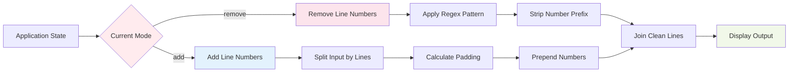
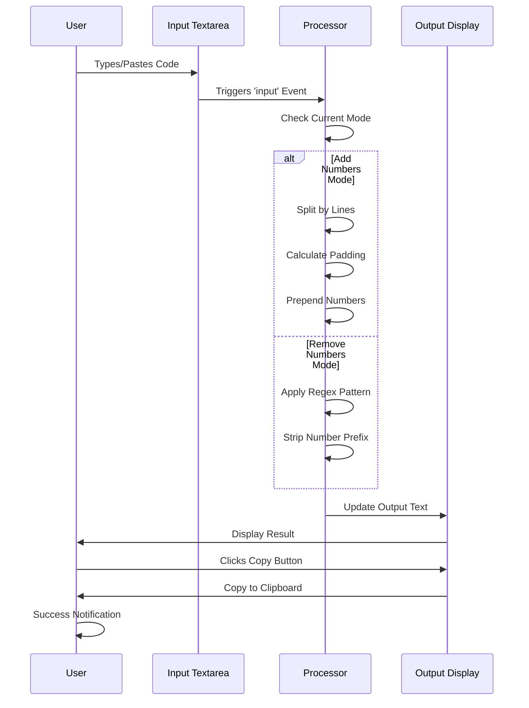

# xsukax Code Line Numberer

A lightweight, privacy-focused web application for adding and removing line numbers from code snippets with real-time processing and zero server dependencies.

[](https://xsukax.github.io/xsukax-Code-Line-Numberer)
[](https://www.gnu.org/licenses/gpl-3.0)
[](https://developer.mozilla.org/en-US/docs/Web/HTML)
[](https://developer.mozilla.org/en-US/docs/Web/JavaScript)
[](https://tailwindcss.com/)

## 🎯 Project Overview

**xsukax Code Line Numberer** is a client-side web application designed to streamline the process of adding or removing line numbers from code snippets. Built with simplicity and efficiency in mind, this tool operates entirely in the browser without requiring server-side processing or external dependencies beyond the included Tailwind CSS CDN for styling.

The application features a dual-mode system that allows users to seamlessly switch between adding sequential line numbers to clean code and removing existing line numbers from numbered code. It preserves original formatting, indentation, and whitespace while processing text in real-time as users type or paste content.

**Key Capabilities:**
- Bidirectional line number processing (add/remove)
- Real-time output generation
- Intelligent padding for proper alignment
- Format-agnostic line number removal (supports various numbering styles)
- Responsive design for desktop and mobile devices
- Clipboard integration for quick copying

## 🔒 Security and Privacy Benefits

This application prioritizes user security and privacy through its architecture and implementation:

### Client-Side Processing
All code processing occurs entirely within the user's browser using JavaScript. No code snippets, text content, or user data are transmitted to external servers, eliminating risks associated with data interception, unauthorized access, or third-party storage.

### Zero Data Persistence
The application does not store, log, or cache any user input. All data exists only in the browser's memory during the active session and is immediately discarded when the page is closed or refreshed. This ephemeral approach ensures complete data privacy.

### No Authentication Required
Users can access and utilize all features without creating accounts, providing personal information, or authenticating through third-party services. This eliminates risks associated with credential theft, account compromise, or identity tracking.

### Minimal External Dependencies
The application relies on only one external resource (Tailwind CSS CDN) for styling, which does not execute user code or access application data. This minimizes the attack surface and reduces exposure to supply chain vulnerabilities.

### Open Source Transparency
As an open-source project, the complete source code is publicly available for security audits, peer review, and verification. Users and security researchers can inspect the codebase to confirm the absence of malicious functionality, backdoors, or privacy violations.

### No Network Requests After Load
Once the initial page loads, the application makes no additional network requests, cookies, or tracking mechanisms. This ensures complete offline functionality and prevents any form of user activity monitoring or data exfiltration.

## ✨ Features and Advantages

### Core Functionality
- **Dual-Mode Operation**: Switch instantly between adding and removing line numbers with visual feedback
- **Real-Time Processing**: See results immediately as you type or paste code
- **Smart Number Alignment**: Automatically adjusts padding based on total line count for consistent formatting
- **Format Recognition**: Intelligently removes various line number formats including spaces, dots, pipes, and parentheses
- **Indentation Preservation**: Maintains original code structure, spacing, and formatting integrity

### User Experience
- **One-Click Copy**: Built-in clipboard integration with success notifications
- **Clear Input Button**: Quickly reset both input and output areas
- **Visual Status Indicators**: Real-time feedback on current mode and processing state
- **Keyboard Shortcuts**: `Ctrl+M` (or `Cmd+M` on Mac) to toggle between modes
- **Responsive Design**: Optimized for all screen sizes from mobile to desktop

### Technical Benefits
- **No Installation Required**: Works directly in any modern web browser
- **Zero Configuration**: No setup, dependencies, or build process needed
- **Offline Capable**: Functions without internet connection after initial load
- **Cross-Platform**: Compatible with Windows, macOS, Linux, iOS, and Android
- **Lightweight**: Single HTML file under 10KB (excluding CDN resources)
- **Fast Performance**: Processes thousands of lines instantly without lag

### Developer-Friendly
- **Clean, Readable Code**: Well-commented JavaScript with logical structure
- **Easy Customization**: Straightforward HTML/CSS/JS architecture for modifications
- **No Build Process**: Direct file editing and immediate deployment
- **Standards Compliant**: Uses modern ES6+ JavaScript and semantic HTML5

## 📦 Installation Instructions

### Option 1: Direct Browser Usage (Recommended)
Access the live application immediately without installation:

**Demo URL**: [https://xsukax.github.io/xsukax-Code-Line-Numberer](https://xsukax.github.io/xsukax-Code-Line-Numberer)

### Option 2: Local Deployment

#### Clone the Repository
```bash
git clone https://github.com/xsukax/xsukax-Code-Line-Numberer.git
cd xsukax-Code-Line-Numberer
```

#### Open in Browser
Simply open the `index.html` file in any modern web browser:

**On Windows:**
```bash
start index.html
```

**On macOS:**
```bash
open index.html
```

**On Linux:**
```bash
xdg-open index.html
```

Alternatively, double-click the `index.html` file in your file explorer.

### Option 3: Web Server Deployment

For hosting on a web server (Apache, Nginx, GitHub Pages, etc.):

1. Upload `index.html` to your web server's public directory
2. Ensure the file has appropriate read permissions
3. Access via your domain or server IP address

**Example for Apache/Nginx:**
```bash
cp index.html /var/www/html/
```

**For GitHub Pages:**
1. Push `index.html` to your repository
2. Enable GitHub Pages in repository settings
3. Select the branch containing `index.html`
4. Access via `https://username.github.io/repository-name/`

### System Requirements
- Any modern web browser (Chrome 90+, Firefox 88+, Safari 14+, Edge 90+)
- JavaScript enabled (required for functionality)
- No server-side requirements or PHP configuration needed
- Approximately 5MB available memory for processing large code files

## 📖 Usage Guide

### Application Workflow



### Mode Selection Architecture



### Step-by-Step Instructions

#### Adding Line Numbers

1. **Open the Application**: Navigate to the demo URL or open your local `index.html` file
2. **Verify Mode**: Ensure the mode badge displays "Mode: Add Numbers" (blue background)
3. **Input Code**: Paste or type your code into the left "Input" textarea
4. **View Output**: Numbered code appears automatically in the right "Output" panel
5. **Copy Result**: Click the green "Copy" button to copy the numbered code to clipboard
6. **Success Notification**: A notification confirms successful copying

**Example Input:**
```javascript
function hello() {
  console.log('Hello World');
}
```

**Example Output:**
```javascript
1  function hello() {
2    console.log('Hello World');
3  }
```

#### Removing Line Numbers

1. **Switch Mode**: Click the "Swap Mode" button or press `Ctrl+M` (Windows/Linux) or `Cmd+M` (Mac)
2. **Verify Mode**: Confirm the badge shows "Mode: Remove Numbers" (pink background)
3. **Input Numbered Code**: Paste code with line numbers into the input area
4. **View Output**: Clean code without numbers appears automatically
5. **Copy Result**: Click "Copy" to copy the cleaned code

**Supported Number Formats:**
- Standard spacing: `1  code`
- Dot notation: `1. code`
- Pipe notation: `1| code`
- Parenthesis: `1) code`
- Leading zeros: `001  code`
- Mixed spacing: `  1   code`

### Keyboard Shortcuts

| Shortcut | Action |
|----------|--------|
| `Ctrl+M` / `Cmd+M` | Toggle between Add/Remove modes |
| `Ctrl+A` / `Cmd+A` | Select all text in active textarea |
| `Ctrl+C` / `Cmd+C` | Copy selected text |
| `Ctrl+V` / `Cmd+V` | Paste text from clipboard |

### Tips for Best Results

- **Large Files**: The application handles thousands of lines efficiently, but extremely large files (100,000+ lines) may experience slight delays
- **Formatting Preservation**: Original indentation and spacing are always preserved
- **Multiple Formats**: When removing numbers, the tool handles various numbering styles automatically
- **Clear Button**: Use the red "Clear" button to quickly reset both input and output areas
- **Real-Time Feedback**: The output updates instantly as you type—no need to click a "Process" button

### Processing Logic



## ⚙️ PHP Configuration

This application does not require PHP or any server-side configuration. It is a purely client-side HTML/JavaScript application that runs entirely in the browser. No `php.ini` configuration, server setup, or backend processing is needed.

If you choose to host this application on a server that also runs PHP applications, no special PHP configuration is required for this tool to function. Standard web server configuration for serving static HTML files is sufficient.

## 📄 License

This project is licensed under the GNU General Public License v3.0.

---

## 🤝 Contributing

Contributions, issues, and feature requests are welcome! Feel free to check the [issues page](https://github.com/xsukax/xsukax-Code-Line-Numberer/issues).

## 👤 Author

**xsukax**

- GitHub: [@xsukax](https://github.com/xsukax)
- Repository: [xsukax-Code-Line-Numberer](https://github.com/xsukax/xsukax-Code-Line-Numberer)

## ⭐ Show Your Support

Give a ⭐️ if this project helped you!

---

**Created by xsukax | Simple, Fast, Efficient**
